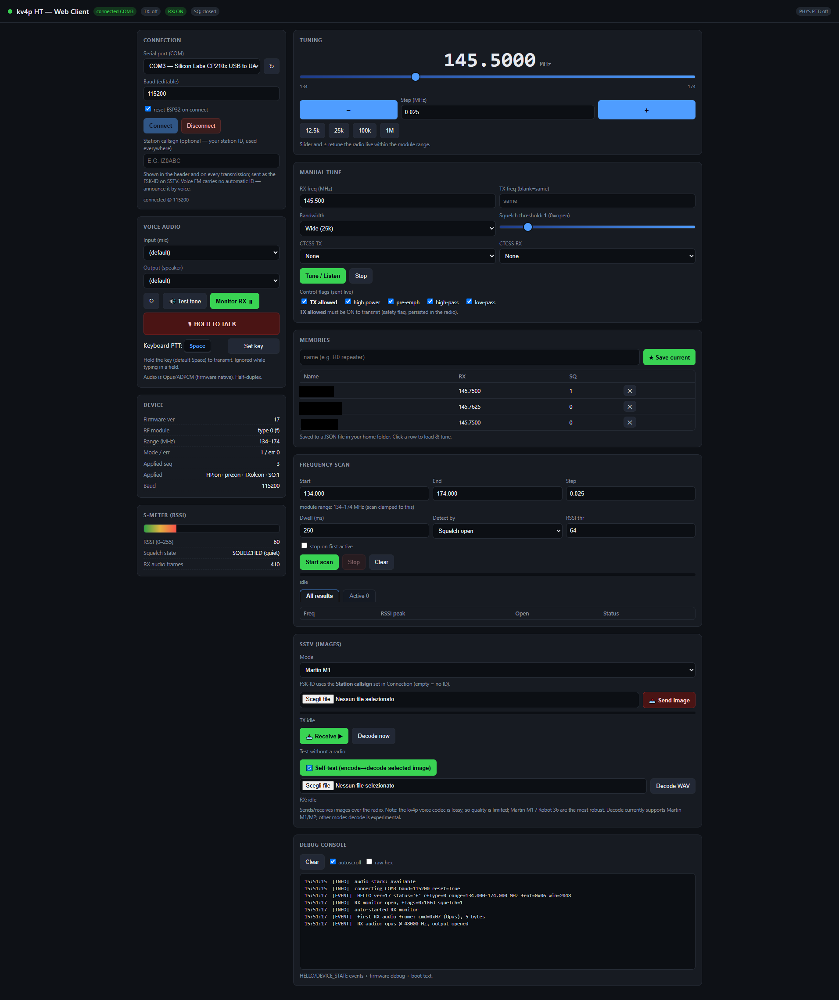
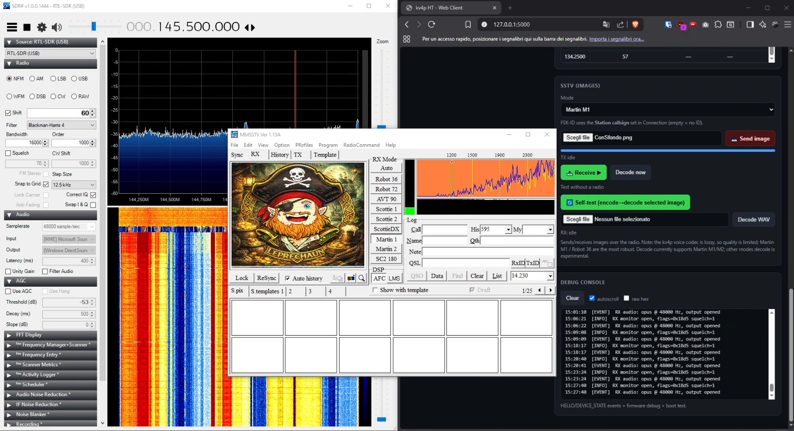

<!-- SPDX-License-Identifier: GPL-3.0-or-later -->
<!-- Author: https://github.com/Leproide -->

# kv4p Web-UI

Cross-platform **web client for the [kv4p HT](https://www.kv4p.com/)** open-source
ham radio: voice RX/TX, frequency scanner, memories, and **SSTV image transmit /
receive**. Pure `pip install` — no C compiler, no MSYS2, no Android phone.

Works on **Windows and Linux**. Speaks the current kv4p serial protocol (KISS
framing + `HOST_DESIRED_STATE` / `DEVICE_STATE` snapshots) and **auto-detects the
firmware's audio codec**: legacy **Opus** (command `0x07`) or **4-bit ADPCM**
(command `0x0C`). Frame layouts were verified byte-for-byte against real hardware.



## Features

- **Connection** — serial port picker, editable baud (default **115200**),
  ESP32 reset on connect, live debug console with optional raw hex dump.
- **Tuning** — large frequency readout, live slider over the module's range,
  `−` / `+` steppers with configurable step (12.5k / 25k / 100k / 1M shortcuts).
- **Voice** — RX monitor and PTT (mouse or **keyboard, default Space**,
  re-bindable). Audio plays on the *computer's* sound card, not in the browser.
- **S-meter / squelch** — RSSI bar, live squelch-threshold slider (0 = monitor),
  open/closed indicator, CTCSS TX/RX selectable in **Hz** (38-tone table).
- **Scanner** — sweeps a range (clamped to the module's limits), detects activity by
  squelch-open or RSSI threshold, with an **Active** tab summarising hits;
  click any row to tune there.
- **Memories** — name and store channels; saved to a JSON file and reloaded
  automatically. Click to load and tune.
- **SSTV** — send and receive images. Encodes **all PySSTV modes** (Martin M1/M2,
  Scottie S1/S2, Robot 36, PD90, PD120, plus B/W Robot 8/24). Decoding supports
  **Martin M1/M2** with automatic VIS detection. Images are sent through a
  high-bitrate Opus profile instead of the speech profile used for voice, which
  roughly halves the codec damage to the tones.
- **Station identification** — the callsign is shown in the header and beside the
  TX indicator, appended to SSTV as a standard **FSK-ID**, and can optionally be
  **burned into the picture** so any decoder shows it.
- **Persistent settings** — TX-allowed, high power, pre-emphasis, high/low-pass,
  squelch, bandwidth, frequency, CTCSS, PTT key, callsign and the callsign-overlay
  choice survive restarts and are re-applied to the radio after each connect.

## Install & run

```bash
pip install -r requirements.txt
python kv4p_web.py
```

Opens <http://127.0.0.1:5000/>. Keep **`kv4p_web.py` and `sstv.py` in the same
folder**.

### Linux notes

PortAudio may need to be installed system-wide, and the serial port is
`/dev/ttyUSB0` rather than `COM3`:

```bash
sudo apt install libportaudio2
sudo usermod -aG dialout $USER   # then log out and back in
```

## Usage

1. Pick the serial port, baud **115200**, keep *reset on connect* checked.
   The console should show a `HELLO` event with the firmware version and the
   module's frequency range. The RX monitor starts automatically.
2. Tick **TX allowed** — the firmware boots with transmit disabled as a safety
   measure. The client remembers your choice and re-applies it on every connect.
3. Tune with the slider, the steppers, or the manual fields, then talk with the
   on-screen PTT or the keyboard key.
4. Optionally set your **station callsign**: it appears in the header and next to
   the TX indicator, and is sent as the SSTV FSK-ID. (FM voice has no data
   channel, so identify by voice as usual.)

### SSTV



Choose a mode, pick an image and press **Send image** — the client generates the
tones, keys the radio and paces the stream in real time. To receive, press
**Receive** and then **Decode now**.

**Identifying yourself.** The callsign is always appended as a standard FSK-ID.
Because some decoders ignore it, or need it explicitly enabled (in MMSSTV:
Option → Setup MMSSTV → RX → *Decode FSKID*), there is also an optional
checkbox that paints the callsign onto the image itself — visible in any
software. It is off by default and remembered between sessions.

Three ways to test **without a second radio**:

- **Self-test** — encodes the selected image and decodes it straight back, no
  radio involved. On a clean signal the round-trip is essentially lossless
  (correlation 1.000).
- **Save as WAV** — renders the full transmission, image and FSK-ID included, to
  a file you can feed to MMSSTV or QSSTV. Note that MMSSTV cannot open a WAV
  directly: route it through a virtual audio cable, or Stereo Mix, and enable
  *Auto slant* so the different playback clock does not skew the picture.
- **Decode WAV** — decode any SSTV recording from a file.

Over the air the kv4p compresses audio with a **lossy codec**, so quality is
limited; **Martin M1** travels best and is also the mode this client decodes.
Every mode can be transmitted, but reception here covers Martin M1/M2 only.

#### SSTV demo video

Sending and receiving an image with kv4p-web:

[](https://youtu.be/CnqYeDS01r0)

## Troubleshooting

| Symptom | Cause |
|---|---|
| Boot banner but no `HELLO` | Wrong baud (use 115200) or the ESP32 didn't reset |
| PTT returns an error | **TX allowed** is off |
| No audio, `no RX audio ... frames` | Firmware isn't streaming — check squelch/signal |
| RSSI stuck at 0 | RSSI is only sampled while RX audio is open |
| `nvs_open failed: NOT_FOUND` at boot | Harmless first-run warning |
| SSTV sent with no callsign | Station callsign left empty — the console logs the FSK-ID used for each transmission |
| Slanted picture when decoding a WAV | Playback clock differs from the sound card; enable *Auto slant* in the decoder |

Enable **raw hex** to inspect the wire: valid frames start with
`c0 06 4b 56 34 50` (`"KV4P"`). The build date is printed at startup and logged
on connect, so it is easy to confirm which version is actually running.

## Transmitting responsibly

Transmit only on frequencies your licence authorises, and observe your national
band plan. The module range reported by the radio (e.g. 134–174 MHz for the VHF
module) is wider than the amateur allocations.

## License

GNU General Public License v3.0 (GPL-3.0-or-later). See [LICENSE](LICENSE).

## Author

https://github.com/Leproide
